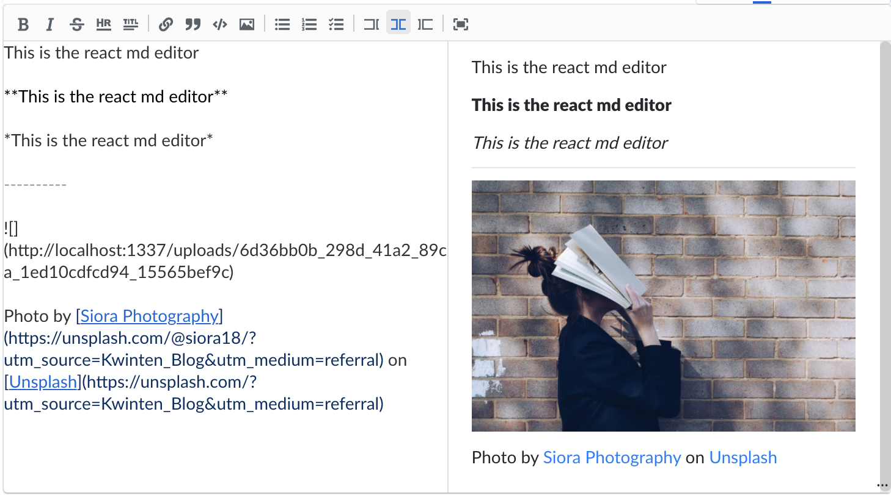

# strapi-plugin-wysiwyg-react-md-editor

This is a [strapi](https://github.com/strapi/strapi) rich text editor plugin based on [react md editor](https://github.com/uiwjs/react-md-editor)



## Customizing the toolbar commands
Default it uses below commands in sequence:
`[
    "title2",
    "title3",
    "title4",
    "title5",
    "title6",
    "divider",
    "bold",
    "codeBlock",
    "italic",
    "strikethrough",
    "hr",
    "group",
    "divider",
    "link",
    "quote",
    "code",
    "unorderedListCommand",
    "orderedListCommand",
    "checkedListCommand",
    "strapiMediaLibrary"
]`

You can customize the value in plugins/config.ts file.
```json
export default {
    "wysiwyg-react-md-editor": {
        enabled: true,
        config: {
            toolbarCommands: ["title1", "strapiMediaLibrary"],
        },
    }
}
```

## Get started
With yarn:

   `yarn add strapi-plugin-wysiwyg-react-md-editor`

   With npm:

   `npm install strapi-plugin-wysiwyg-react-md-editor`

## Make it work

```sh
$ yarn build
$ yarn run develop
```

